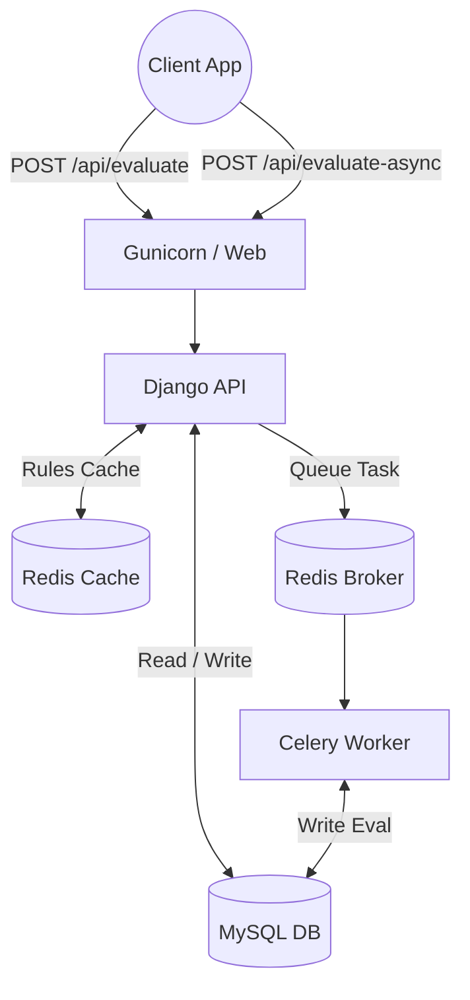

# 🛡️ TrustScore API - Production Grade

A **rule-based risk scoring engine** built with Django & Django REST Framework. Evaluates user behavior data against dynamic rules and calculates a trust score (0–100).

> 🚀 **Live Demo:** [https://trustscore-api-3joi.onrender.com](https://trustscore-api-3joi.onrender.com) (Legacy SQLite Version)

---

## ✨ Production Features

This project has been heavily upgraded to support production workloads:
- **MySQL Database Migration:** Replaced SQLite with robust, concurrent MySQL.
- **Redis Caching:** Active risk rules are aggressively cached using Redis (with auto-invalidation bound to Django admin saves) to avoid high-volume DB lookups.
- **API Rate Limiting:** DRF throttling applied limiting evaluation requests per IP/User to prevent abuse.
- **Celery Async Scoring:** Added an asynchronous evaluation queue leveraging Celery + Redis so complex evaluations don't block web threads.
- **Dockerized Stack:** Fully containerized using `docker-compose` containing `web`, `mysql`, `redis`, and `celery_worker` services.

---

## 📡 API Endpoints

### `POST /api/evaluate-user/` (Synchronous)
Evaluate a user's risk based on their activity data immediately. Rate-limited.

**Request Body:**
```json
{
  "user_id": "U123",
  "account_age_days": 5,
  "failed_logins": 6,
  "transactions_last_24h": 30,
  "ip_changes": 4,
  "avg_transaction_amount": 7000
}
```

### `POST /api/evaluate-user-async/` (Asynchronous)
Drop off a payload and receive a `task_id`. Let Celery process it in the background.

**Response:**
```json
{
  "task_id": "a92b21cf...",
  "status": "QUEUED"
}
```

### `GET /api/evaluation-status/<task_id>/`
Retrieve the async evaluation result once complete.

---

## 🏗 System Architecture



---

## 🐳 Quickstart: Docker Compose

The fastest way to spin up the entire cluster locally:

### 1. Clone the repo
```bash
git clone https://github.com/Priyansh-Mandkaria/TrustScore-API.git
cd TrustScore-API
```

### 2. Configure Environment
```bash
cp docker.env.example .env
```

### 3. Spin up the cluster
```bash
docker-compose up --build
```
> This automatically builds the Python images, links them, boots MySQL and Redis, runs Django migrations automatically, and drops you into a unified log view. 
> The API will be exposed on **`http://localhost:8000`**.

---

## 🚀 Deployment (Railway)

We provide a custom `railway.toml` file to seamlessly build via `Dockerfile` and start the web component.
1. Connect this repo to Railway.
2. Provision a **MySQL Storage** and **Redis Storage** plugin inside your Railway project.
3. Export their credentials to your Django service environment variables (`REDIS_URL`, `DB_HOST`, `DB_USER`, etc.).
4. Add a secondary service using this same repo and set its Start Command to `celery -A trustscore worker --loglevel=info` to fire up your worker.

---

## 🧪 Run Tests

We have 20 comprehensive unit tests that force-mock the Redis limits, stub out the DRF throttles, and force Celery execution securely. 

*Inside the docker container, or your virtual env:*
```bash
python manage.py test scoring -v2
```

---

## 📁 Project Structure

```
├── docker-compose.yml          # Container topology
├── Dockerfile                  # Python app image definition
├── railway.toml                # Railway deployment config
├── trustscore/                 # Django project config (settings with Celery)
├── scoring/                    # Main app
│   ├── tasks.py                # Celery async jobs
│   ├── services.py             # RiskScoringEngine w/ Redis cache logic
│   ├── throttles.py            # DRF Rate Limiter logic
│   ├── admin.py                # Cache invalidation overrides
│   ├── tests.py                # Comprehensive testing
```

---

## 📄 License
MIT